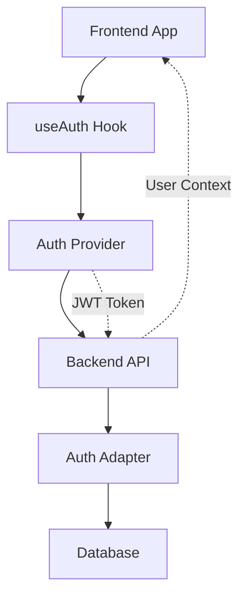

# Authentication & Authorization

Boards provides a flexible, pluggable authentication system that supports multiple auth providers while maintaining a consistent interface for your application code.

## Key Features

- **Provider-agnostic**: Support for Supabase, Clerk, Auth0, custom JWT, and OIDC
- **Stable frontend interface**: `useAuth()` hook works the same regardless of provider
- **Board-scoped RBAC**: Role-based access control with `owner`, `editor`, `viewer` roles
- **Multi-tenancy**: Support for multiple tenants with isolated data
- **JIT provisioning**: Users auto-created on first login from any provider
- **SSR-friendly**: Token management works in both client and server environments

## Architecture Overview



### Backend Components

- **AuthAdapter Interface**: Provider-agnostic token verification
- **AuthContext**: Runtime authentication context for requests
- **Middleware**: Extracts tokens, verifies with adapters, provides context
- **JIT Provisioning**: Auto-creates local users from external identities
- **RBAC System**: Board-scoped permissions with helper functions

### Frontend Components

- **useAuth Hook**: Stable interface regardless of auth provider
- **Auth Providers**: Provider-specific implementations (JWT, Supabase, etc.)
- **GraphQL Client**: Automatic token injection via urql exchanges
- **Context System**: React context for auth state management

## Quick Start

### 1. Choose Your Auth Provider

```typescript
// No Auth (development only - included in core package)
import { NoAuthProvider } from "@weirdfingers/boards";
const authProvider = new NoAuthProvider();

// JWT (self-managed - separate package)
import { JWTAuthProvider } from "@weirdfingers/auth-jwt";
const authProvider = new JWTAuthProvider({
  apiUrl: "http://localhost:8000/api",
  tenantId: "my-company",
});

// Supabase (separate package)
import { SupabaseAuthProvider } from "@weirdfingers/auth-supabase";
const authProvider = new SupabaseAuthProvider({
  url: process.env.NEXT_PUBLIC_SUPABASE_URL,
  anonKey: process.env.NEXT_PUBLIC_SUPABASE_ANON_KEY,
});

// Clerk (separate package)
import { ClerkAuthProvider } from "@weirdfingers/auth-clerk";
const authProvider = new ClerkAuthProvider({
  publishableKey: process.env.NEXT_PUBLIC_CLERK_PUBLISHABLE_KEY,
});
```

### 2. Set Up Your App

```typescript
import { AuthProvider, createGraphQLClient } from "@weirdfingers/boards";

function App() {
  const graphqlClient = createGraphQLClient({
    url: "http://localhost:8000/graphql",
    auth: authProvider,
    tenantId: "my-company",
  });

  return (
    <AuthProvider provider={authProvider}>
      <Provider value={graphqlClient}>
        <MyApp />
      </Provider>
    </AuthProvider>
  );
}
```

### 3. Use in Components

```typescript
import { useAuth } from "@weirdfingers/boards";

function MyComponent() {
  const { user, status, signIn, signOut } = useAuth();

  if (status === "loading") return <div>Loading...</div>;
  if (status === "unauthenticated") {
    return <button onClick={() => signIn()}>Sign In</button>;
  }

  return (
    <div>
      <p>Hello, {user?.displayName}!</p>
      <button onClick={signOut}>Sign Out</button>
    </div>
  );
}
```

## Configuration

### Backend Configuration

Set environment variables:

```bash
# Choose your auth provider (defaults to 'none' for development)
BOARDS_AUTH_PROVIDER=none  # or 'jwt', 'supabase', 'clerk', 'auth0'

# Provider-specific config
# For JWT:
BOARDS_JWT_SECRET=your-secret-key

# For Supabase:
SUPABASE_URL=https://your-project.supabase.co
SUPABASE_SERVICE_ROLE_KEY=your-service-role-key

# For no-auth (optional):
BOARDS_AUTH_CONFIG='{"default_user_id": "my-dev-user"}'
```

### Frontend Configuration

Install the core package and your chosen auth provider:

```bash
# Core package (always required)
npm install @weirdfingers/boards

# Choose one or more auth providers:
npm install @weirdfingers/auth-supabase @supabase/supabase-js
npm install @weirdfingers/auth-clerk @clerk/clerk-js
npm install @weirdfingers/auth-auth0 @auth0/auth0-spa-js
npm install @weirdfingers/auth-jwt
```

## Provider Packages

Each auth provider is in its own package to keep your bundle size minimal:

| Package                       | Dependencies            | Bundle Impact     |
| ----------------------------- | ----------------------- | ----------------- |
| `@weirdfingers/boards`        | None                    | ~15KB (core only) |
| `@weirdfingers/auth-supabase` | `@supabase/supabase-js` | ~40KB             |
| `@weirdfingers/auth-clerk`    | `@clerk/clerk-js`       | ~50KB             |
| `@weirdfingers/auth-auth0`    | `@auth0/auth0-spa-js`   | ~25KB             |
| `@weirdfingers/auth-jwt`      | None                    | ~5KB              |

**Benefits:**

- 🌲 **Tree-shakable**: Only bundle what you use
- 📦 **Small bundles**: Core package is tiny
- 🔄 **Easy migration**: Swap providers without breaking changes
- 🛡️ **Type-safe**: Full TypeScript support

## Next Steps

- **Getting Started**: [No Auth Setup](./providers/none.md) - Perfect for development
- **Production Setup**: [JWT](./providers/jwt.md) or [Supabase](./providers/supabase.md)
- [Authorization](./backend/authorization.md) - RBAC and permissions
- [Frontend Integration](./frontend/getting-started.md) - Frontend usage patterns
- [Backend Integration](./backend/auth-adapters.md) - Backend implementation details
