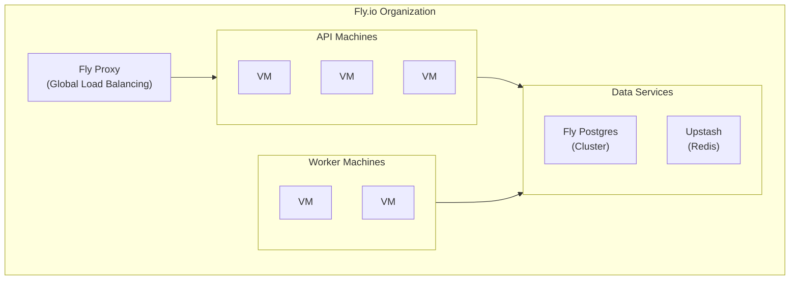

# Fly.io

[Fly.io](https://fly.io) deploys applications close to users via their global edge network, with built-in support for multi-region deployments.

## Why Fly.io?

- **Global edge deployment**: Run apps close to users worldwide
- **Built-in databases**: Managed PostgreSQL and Redis
- **Machines API**: Fine-grained control over compute
- **Generous free tier**: 3 shared VMs, 3GB storage

## Architecture



## Prerequisites

Install the Fly CLI:

```bash
# macOS
brew install flyctl

# Linux
curl -L https://fly.io/install.sh | sh

# Login
fly auth login
```

## Quick Start

### 1. Create PostgreSQL

```bash
fly postgres create --name boards-db
```

Note the connection string provided.

### 2. Create Redis (via Upstash)

Fly.io integrates with Upstash for Redis:

```bash
fly redis create --name boards-redis
```

Or use the Upstash dashboard directly.

### 3. Create API Application

Create `fly.toml` for the API:

```toml
app = "boards-api"
primary_region = "iad"  # Choose your region

[build]
  image = "ghcr.io/weirdfingers/boards-backend:latest"

[env]
  BOARDS_LOG_FORMAT = "json"
  BOARDS_LOG_LEVEL = "info"
  PORT = "8800"

[http_service]
  internal_port = 8800
  force_https = true
  auto_stop_machines = true
  auto_start_machines = true
  min_machines_running = 1
  processes = ["app"]

[[http_service.checks]]
  grace_period = "10s"
  interval = "30s"
  method = "GET"
  timeout = "5s"
  path = "/health"

[[vm]]
  cpu_kind = "shared"
  cpus = 1
  memory_mb = 512
```

Launch the app:

```bash
fly launch --copy-config --no-deploy
```

### 4. Set Secrets

```bash
# Database URL
fly secrets set BOARDS_DATABASE_URL="postgres://..." --app boards-api

# Redis URL
fly secrets set BOARDS_REDIS_URL="redis://..." --app boards-api

# Generator API keys
fly secrets set BOARDS_GENERATOR_API_KEYS='{"fal": "key", "openai": "key"}' --app boards-api

# Auth configuration
fly secrets set BOARDS_AUTH_PROVIDER=none --app boards-api
```

### 5. Attach PostgreSQL

```bash
fly postgres attach boards-db --app boards-api
```

This automatically sets the `DATABASE_URL` secret.

### 6. Deploy

```bash
fly deploy --app boards-api
```

### 7. Create Worker Application

Create `fly.worker.toml`:

```toml
app = "boards-worker"
primary_region = "iad"

[build]
  image = "ghcr.io/weirdfingers/boards-backend:latest"

[env]
  BOARDS_LOG_FORMAT = "json"
  BOARDS_LOG_LEVEL = "info"
  BOARDS_INTERNAL_API_URL = "http://boards-api.internal:8800"

[processes]
  worker = "boards-worker --log-level info --processes 1 --threads 1"

[[vm]]
  cpu_kind = "shared"
  cpus = 1
  memory_mb = 1024
```

Deploy worker:

```bash
fly launch --config fly.worker.toml --copy-config --no-deploy
fly secrets set BOARDS_DATABASE_URL="postgres://..." --app boards-worker
fly secrets set BOARDS_REDIS_URL="redis://..." --app boards-worker
fly secrets set BOARDS_GENERATOR_API_KEYS='{"fal": "key", "openai": "key"}' --app boards-worker
fly postgres attach boards-db --app boards-worker
fly deploy --config fly.worker.toml
```

## Configuration Files

Mount config files using Fly volumes:

```bash
# Create volume
fly volumes create config_data --size 1 --app boards-api

# In fly.toml, add mount
[mounts]
  source = "config_data"
  destination = "/app/config"
```

Upload config files:

```bash
fly ssh console --app boards-api
# Upload files via SFTP or create them
```

Alternative: Use environment variables for simple configs.

## Multi-Region Deployment

Deploy API to multiple regions:

```bash
fly scale count 2 --region iad,lax --app boards-api
```

Fly automatically routes requests to the nearest region.

For workers, stick to one region near your database:

```bash
fly scale count 2 --region iad --app boards-worker
```

## Private Networking

Fly.io provides private networking via `.internal` domains:

```bash
# API accessible from worker as:
BOARDS_INTERNAL_API_URL=http://boards-api.internal:8800
```

## Custom Domain

```bash
fly certs add api.boards.example.com --app boards-api
```

Add the provided DNS records to your domain.

## Scaling

### Horizontal Scaling

```bash
# Scale API to 3 machines
fly scale count 3 --app boards-api

# Scale workers
fly scale count 2 --app boards-worker
```

### Vertical Scaling

```bash
# More memory
fly scale memory 1024 --app boards-api

# More CPU
fly scale vm shared-cpu-2x --app boards-api
```

### Auto-scaling

In `fly.toml`:

```toml
[http_service]
  auto_stop_machines = true
  auto_start_machines = true
  min_machines_running = 1
```

Machines auto-stop when idle and start on incoming requests.

## Monitoring

### Logs

```bash
# Stream logs
fly logs --app boards-api

# Worker logs
fly logs --app boards-worker
```

### Metrics

View in Fly dashboard or via CLI:

```bash
fly status --app boards-api
```

### Grafana Integration

Fly provides Prometheus metrics. Export to Grafana:

```bash
fly metrics dashboard --app boards-api
```

## SSH Access

```bash
# SSH into a machine
fly ssh console --app boards-api

# Run a command
fly ssh console --app boards-api -C "python -c 'from boards.db import engine; print(engine.url)'"
```

## Secrets Management

```bash
# List secrets
fly secrets list --app boards-api

# Set secret
fly secrets set KEY=value --app boards-api

# Unset secret
fly secrets unset KEY --app boards-api
```

## CI/CD with GitHub Actions

Create `.github/workflows/deploy.yml`:

```yaml
name: Deploy to Fly.io

on:
  push:
    branches: [main]

jobs:
  deploy:
    runs-on: ubuntu-latest
    steps:
      - uses: actions/checkout@v4
      - uses: superfly/flyctl-actions/setup-flyctl@master
      - run: flyctl deploy --remote-only --app boards-api
        env:
          FLY_API_TOKEN: ${{ secrets.FLY_API_TOKEN }}
      - run: flyctl deploy --remote-only --app boards-worker --config fly.worker.toml
        env:
          FLY_API_TOKEN: ${{ secrets.FLY_API_TOKEN }}
```

Get deploy token:

```bash
fly tokens create deploy --app boards-api
```

Add to GitHub secrets as `FLY_API_TOKEN`.

## Cost Estimation

| Resource | Specs | Monthly |
|----------|-------|---------|
| API (2 machines) | shared-cpu-1x, 512MB | ~$6 |
| Worker (1 machine) | shared-cpu-1x, 1GB | ~$5 |
| PostgreSQL | 1GB | ~$7 |
| Redis (Upstash) | Pay per request | ~$0-5 |
| **Total** | | **~$18-23** |

Free tier includes 3 shared VMs.

## Troubleshooting

### Machine Won't Start

```bash
# Check machine status
fly status --app boards-api

# View recent logs
fly logs --app boards-api

# Check machine events
fly machines list --app boards-api
```

### Database Connection Issues

```bash
# Test connection
fly ssh console --app boards-api -C "python -c 'from boards.db import engine; print(engine.connect())'"

# Check DATABASE_URL is set
fly secrets list --app boards-api
```

### Out of Memory

```bash
# Increase memory
fly scale memory 1024 --app boards-api
```

### Worker Not Processing

1. Check worker is running: `fly status --app boards-worker`
2. Verify Redis connection
3. Check worker logs: `fly logs --app boards-worker`

## Next Steps

- [Storage Configuration](../storage.md) - Set up S3 or GCS
- [Authentication](../authentication.md) - Configure auth providers
- [Monitoring](../monitoring.md) - Advanced observability
