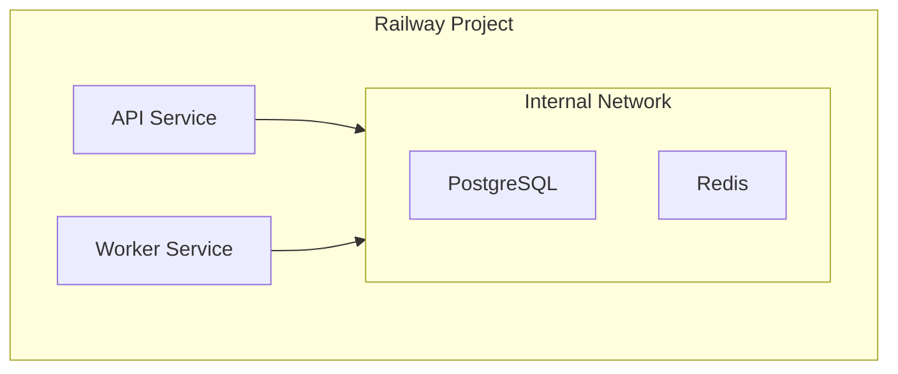

# Railway

[Railway](https://railway.app) is a deployment platform that makes it easy to deploy containerized applications with built-in databases and automatic scaling.

## Why Railway?

- **Simple setup**: Deploy from GitHub or Docker images
- **Built-in services**: PostgreSQL, Redis included
- **Automatic SSL**: Free HTTPS for all deployments
- **Fair pricing**: Pay for actual usage

## Architecture

Railway deploys each service as a separate container:



## Quick Start with Scaffolded Config

Projects scaffolded with `npx @weirdfingers/baseboards up` include a pre-configured `railway.json` that defines all three services (api, worker, web) with proper environment variable wiring. See `DEPLOY.md` in your scaffolded project for step-by-step instructions.

```bash
# Your scaffolded project includes:
# railway.json          — Multi-service Railway configuration
# .env.production.example — Reference for all production env vars
# DEPLOY.md             — Step-by-step deployment guide
```

## Quick Start (Manual)

### 1. Create a Railway Project

1. Go to [railway.app](https://railway.app) and sign in
2. Click **New Project**
3. Choose **Empty Project**

### 2. Add PostgreSQL

1. Click **+ New** > **Database** > **Add PostgreSQL**
2. Railway automatically provisions the database
3. Note the `DATABASE_URL` from the **Variables** tab

### 3. Add Redis

1. Click **+ New** > **Database** > **Add Redis**
2. Note the `REDIS_URL` from the **Variables** tab

### 4. Add Object Storage (Railway Buckets)

1. Click **+ New** > **Add** > **Object Storage (S3-compatible)**
2. Railway provisions an S3-compatible bucket with credentials
3. Note the storage credentials from the **Variables** tab:
   - `RAILWAY_STORAGE_ENDPOINT`
   - `RAILWAY_STORAGE_ACCESS_KEY_ID`
   - `RAILWAY_STORAGE_SECRET_ACCESS_KEY`
   - `RAILWAY_STORAGE_BUCKET_NAME`

### 5. Deploy API Service

1. Click **+ New** > **Docker Image**
2. Enter: `ghcr.io/weirdfingers/boards-backend:latest`
3. Configure the service:

**Settings tab:**
- Start Command: `alembic -c /app/src/boards/alembic.ini upgrade head && uvicorn boards.api.app:app --host 0.0.0.0 --port $PORT`
- Port: Leave as auto-detected

**Variables tab:**
```
BOARDS_DATABASE_URL=${{Postgres.DATABASE_URL}}
BOARDS_REDIS_URL=${{Redis.REDIS_URL}}
BOARDS_AUTH_PROVIDER=none
BOARDS_LOG_FORMAT=json
BOARDS_CORS_ORIGINS=["https://${{web.RAILWAY_PUBLIC_DOMAIN}}"]
BOARDS_JWT_SECRET=<generate-a-random-secret>
AWS_ACCESS_KEY_ID=${{storage.RAILWAY_STORAGE_ACCESS_KEY_ID}}
AWS_SECRET_ACCESS_KEY=${{storage.RAILWAY_STORAGE_SECRET_ACCESS_KEY}}
REPLICATE_API_TOKEN=your-token
```

4. Click **Deploy**

### 6. Deploy Worker Service

1. Click **+ New** > **Docker Image**
2. Enter: `ghcr.io/weirdfingers/boards-backend:latest`
3. Configure:

**Settings tab:**
- Start Command: `boards-worker --log-level info --processes 1 --threads 1`

**Variables tab:**
```
BOARDS_DATABASE_URL=${{Postgres.DATABASE_URL}}
BOARDS_REDIS_URL=${{Redis.REDIS_URL}}
BOARDS_INTERNAL_API_URL=http://${{api.RAILWAY_PRIVATE_DOMAIN}}:8800
BOARDS_LOG_FORMAT=json
AWS_ACCESS_KEY_ID=${{storage.RAILWAY_STORAGE_ACCESS_KEY_ID}}
AWS_SECRET_ACCESS_KEY=${{storage.RAILWAY_STORAGE_SECRET_ACCESS_KEY}}
REPLICATE_API_TOKEN=your-token
```

4. Click **Deploy**

## Configuration Files

For generators and storage config, you have two options:

### Option 1: Environment Variables

Set config directly in environment:

```
AWS_ACCESS_KEY_ID=xxxxx
AWS_SECRET_ACCESS_KEY=xxxxx
```

### Option 2: GitHub Repository

Deploy from a repository with config files (scaffolded projects already have this structure):

```
├── config/
│   ├── generators.yaml
│   └── storage_config.yaml
├── railway.json
├── fly.api.toml
├── fly.web.toml
├── fly.worker.toml
├── Dockerfile.web
├── .env.production.example
└── DEPLOY.md
```

Connect your repository to Railway and it will use the `railway.json` configuration automatically.

## Domain Configuration

### Railway Domain

Railway provides a free subdomain:

1. Go to your API service
2. Click **Settings** > **Networking**
3. Click **Generate Domain**

### Custom Domain

1. Go to **Settings** > **Networking**
2. Click **+ Custom Domain**
3. Enter your domain (e.g., `api.boards.example.com`)
4. Add the CNAME record to your DNS

## Deploy Frontend

1. Click **+ New** > **GitHub Repo**
2. Select your frontend repository
3. Configure environment variables:

```
NEXT_PUBLIC_API_URL=https://your-api.railway.app
NEXT_PUBLIC_GRAPHQL_URL=https://your-api.railway.app/graphql
```

Or use Docker image:

1. **+ New** > **Docker Image**
2. Build and push your frontend image to a registry
3. Enter the image URL

## Scaling

### Horizontal Scaling

Railway Pro supports multiple replicas:

1. Go to service **Settings**
2. Under **Replicas**, increase the count

### Resource Limits

Configure memory and CPU:

1. Go to service **Settings**
2. Adjust **Memory** and **CPU** limits

## Private Networking

Services communicate via internal network:

```bash
# Reference other services
BOARDS_INTERNAL_API_URL=http://${{api.RAILWAY_PRIVATE_DOMAIN}}:8800
```

The `RAILWAY_PRIVATE_DOMAIN` variable is automatically set.

## Monitoring

### Logs

View logs in the Railway dashboard:

1. Click on a service
2. Go to **Deployments** tab
3. Click **View Logs**

Or use the CLI:

```bash
railway logs
```

### Metrics

Railway shows basic metrics:
- CPU usage
- Memory usage
- Network traffic

For advanced monitoring, integrate with external tools.

## CI/CD

### Automatic Deploys

Railway automatically deploys when:
- You push to the connected branch
- Docker image tag is updated (requires redeploy)

### Manual Deploys

```bash
# Install Railway CLI
npm install -g @railway/cli

# Login
railway login

# Deploy
railway up
```

### Deploy Hook

Use webhooks to trigger deploys:

1. Go to project **Settings**
2. Find **Deploy Hooks**
3. Use the webhook URL in your CI pipeline

## Environment Templates

Create reusable templates with Railway's template feature:

1. Configure your project
2. Click **Settings** > **Create Template**
3. Share the template URL for one-click deploys

## Cost Estimation

Railway pricing (as of writing):

| Resource | Cost |
|----------|------|
| Compute | $0.000231/vCPU/min |
| Memory | $0.000231/GB/min |
| PostgreSQL | Included in compute |
| Redis | Included in compute |

Estimated monthly costs:
- Small deployment: $5-15
- Medium deployment: $20-50
- Large deployment: $100+

Free tier includes $5/month credit.

## Troubleshooting

### Service Won't Start

1. Check **Deployments** for build/deploy logs
2. Verify environment variables are set
3. Check start command syntax

### Database Connection Failed

1. Verify `${{Postgres.DATABASE_URL}}` syntax
2. Check PostgreSQL service is healthy
3. Test connection in Railway shell:

```bash
railway run python -c "from boards.db import engine; print(engine.connect())"
```

### Redis Connection Failed

1. Verify `${{Redis.REDIS_URL}}` syntax
2. Check Redis service is healthy
3. Ensure REDIS_URL uses correct format

## Next Steps

- [Storage Configuration](../storage.md) - Set up S3 or other storage
- [Authentication](../authentication.md) - Configure auth providers
- [Monitoring](../monitoring.md) - Add external monitoring
