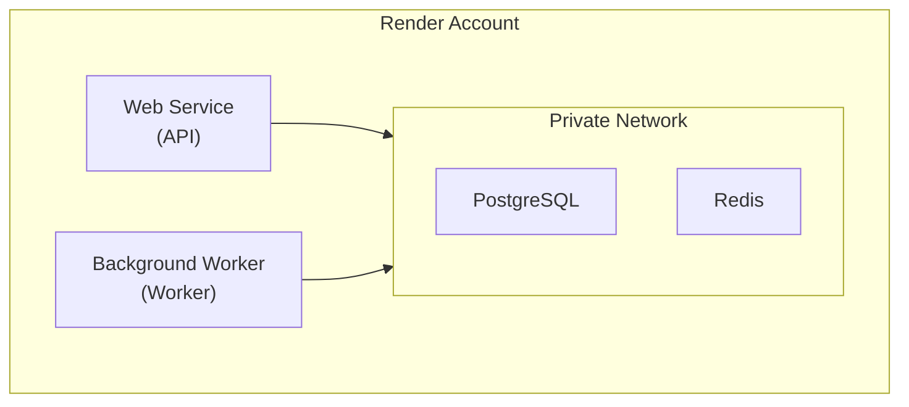

# Render

[Render](https://render.com) is a unified cloud platform for deploying web services, databases, and background workers with automatic scaling and free SSL.

## Why Render?

- **Simple pricing**: Predictable, straightforward costs
- **Built-in databases**: Managed PostgreSQL and Redis
- **Auto-deploy**: Automatic deploys from Git
- **Free tier**: Limited free services for testing

## Architecture



## Quick Start

### 1. Create PostgreSQL Database

1. Go to [render.com](https://render.com) and sign in
2. Click **New** > **PostgreSQL**
3. Configure:
   - Name: `boards-db`
   - Database: `boards`
   - User: `boards`
   - Region: Choose closest to users
4. Click **Create Database**
5. Copy the **Internal Database URL**

### 2. Create Redis Instance

1. Click **New** > **Redis**
2. Configure:
   - Name: `boards-redis`
   - Region: Same as database
3. Click **Create Redis**
4. Copy the **Internal Redis URL**

### 3. Deploy API Service

1. Click **New** > **Web Service**
2. Select **Deploy an existing image from a registry**
3. Configure:

**Image Settings:**
- Image URL: `ghcr.io/weirdfingers/boards-backend:latest`

**Service Settings:**
- Name: `boards-api`
- Region: Same as database
- Instance Type: Starter ($7/month) or higher

**Environment Variables:**
```
BOARDS_DATABASE_URL=<internal-database-url>
BOARDS_REDIS_URL=<internal-redis-url>
BOARDS_GENERATOR_API_KEYS={"fal": "your-key", "openai": "your-key"}
BOARDS_AUTH_PROVIDER=none
BOARDS_LOG_FORMAT=json
PORT=8800
```

**Docker Command:**
```
uvicorn boards.api.app:app --host 0.0.0.0 --port 8800
```

4. Click **Create Web Service**

### 4. Deploy Worker Service

1. Click **New** > **Background Worker**
2. Select **Deploy an existing image from a registry**
3. Configure:

**Image Settings:**
- Image URL: `ghcr.io/weirdfingers/boards-backend:latest`

**Service Settings:**
- Name: `boards-worker`
- Region: Same as database
- Instance Type: Starter or higher

**Environment Variables:**
```
BOARDS_DATABASE_URL=<internal-database-url>
BOARDS_REDIS_URL=<internal-redis-url>
BOARDS_GENERATOR_API_KEYS={"fal": "your-key", "openai": "your-key"}
BOARDS_INTERNAL_API_URL=http://boards-api:8800
BOARDS_LOG_FORMAT=json
```

**Docker Command:**
```
boards-worker --log-level info --processes 1 --threads 1
```

4. Click **Create Background Worker**

## Blueprint (Infrastructure as Code)

Create a `render.yaml` for one-click deployment:

```yaml
services:
  # API Service
  - type: web
    name: boards-api
    env: docker
    dockerfilePath: ./Dockerfile
    dockerCommand: uvicorn boards.api.app:app --host 0.0.0.0 --port 8800
    healthCheckPath: /health
    envVars:
      - key: BOARDS_DATABASE_URL
        fromDatabase:
          name: boards-db
          property: connectionString
      - key: BOARDS_REDIS_URL
        fromService:
          name: boards-redis
          type: redis
          property: connectionString
      - key: BOARDS_GENERATOR_API_KEYS
        sync: false
      - key: BOARDS_AUTH_PROVIDER
        value: none
      - key: BOARDS_LOG_FORMAT
        value: json
      - key: PORT
        value: 8800

  # Worker Service
  - type: worker
    name: boards-worker
    env: docker
    dockerfilePath: ./Dockerfile
    dockerCommand: boards-worker --log-level info --processes 1 --threads 1
    envVars:
      - key: BOARDS_DATABASE_URL
        fromDatabase:
          name: boards-db
          property: connectionString
      - key: BOARDS_REDIS_URL
        fromService:
          name: boards-redis
          type: redis
          property: connectionString
      - key: BOARDS_GENERATOR_API_KEYS
        sync: false
      - key: BOARDS_INTERNAL_API_URL
        fromService:
          name: boards-api
          type: web
          property: hostport

databases:
  - name: boards-db
    databaseName: boards
    user: boards

# Note: Redis is a paid feature, add manually if needed
```

Deploy with blueprint:

1. Push `render.yaml` to your repository
2. Click **New** > **Blueprint**
3. Connect your repository
4. Render creates all services automatically

## Environment Groups

Share environment variables across services:

1. Go to **Environment Groups**
2. Create group `boards-shared`
3. Add common variables:

```
BOARDS_GENERATOR_API_KEYS={"fal": "key", "openai": "key"}
BOARDS_AUTH_PROVIDER=jwt
BOARDS_JWT_SECRET=your-secret
```

4. Link to services in their settings

## Custom Domain

1. Go to your API service **Settings**
2. Under **Custom Domains**, click **Add Custom Domain**
3. Enter your domain (e.g., `api.boards.example.com`)
4. Add the provided CNAME record to your DNS
5. Render automatically provisions SSL

## Private Network

Services on Render communicate via private network:

- Use internal URLs (e.g., `boards-api:8800`)
- No external traffic charges
- Lower latency

Reference internal services:

```
BOARDS_INTERNAL_API_URL=http://boards-api:8800
```

## Scaling

### Horizontal Scaling

1. Go to service **Settings**
2. Under **Scaling**, adjust instance count

### Vertical Scaling

1. Go to service **Settings**
2. Change **Instance Type**:

| Type | RAM | CPU | Monthly |
|------|-----|-----|---------|
| Starter | 512 MB | 0.5 CPU | $7 |
| Standard | 2 GB | 1 CPU | $25 |
| Pro | 4 GB | 2 CPU | $85 |
| Pro Plus | 8 GB | 4 CPU | $175 |

## Deploy Frontend

### Option 1: Static Site

1. Click **New** > **Static Site**
2. Connect your frontend repository
3. Configure:
   - Build Command: `pnpm build`
   - Publish Directory: `out` (for exported Next.js)
4. Add environment variables:

```
NEXT_PUBLIC_API_URL=https://boards-api.onrender.com
NEXT_PUBLIC_GRAPHQL_URL=https://boards-api.onrender.com/graphql
```

### Option 2: Web Service

For SSR or API routes:

1. Click **New** > **Web Service**
2. Connect your frontend repository
3. Configure:
   - Build Command: `pnpm build`
   - Start Command: `pnpm start`

## Disk Storage

For persistent storage (if using local storage):

1. Go to service **Settings**
2. Under **Disks**, click **Add Disk**
3. Configure:
   - Name: `storage`
   - Mount Path: `/app/data/storage`
   - Size: 10 GB (minimum)

## Monitoring

### Logs

View logs in dashboard:

1. Click on service
2. Go to **Logs** tab

Or use the CLI:

```bash
render logs --service boards-api
```

### Metrics

Render provides basic metrics:
- CPU usage
- Memory usage
- Request count
- Response times

### Health Checks

Configure health checks:

1. Go to service **Settings**
2. Set **Health Check Path**: `/health`
3. Render restarts unhealthy instances automatically

## CI/CD

### Automatic Deploys

Enable in service settings:

1. Go to **Settings**
2. Under **Build & Deploy**, enable **Auto-Deploy**
3. Deploys trigger on push to connected branch

### Deploy Hooks

Use webhooks for custom CI:

1. Go to service **Settings**
2. Find **Deploy Hook URL**
3. POST to this URL to trigger deploy

## Cost Estimation

| Service | Type | Monthly |
|---------|------|---------|
| API | Starter | $7 |
| Worker | Starter | $7 |
| PostgreSQL | Starter | $7 |
| Redis | Starter | $10 |
| **Total** | | **~$31** |

Scale up as needed. Free tier available for static sites.

## Troubleshooting

### Build Failures

1. Check build logs in dashboard
2. Verify Dockerfile/commands are correct
3. Test build locally first

### Service Not Starting

1. Check logs for errors
2. Verify environment variables
3. Check Docker command syntax

### Database Connection

1. Verify using internal URL
2. Check database is in same region
3. Test connection:

```bash
render shell boards-api
python -c "from boards.db import engine; print(engine.connect())"
```

### Slow Cold Starts

Render spins down free/starter instances. To prevent:
- Upgrade to Standard or higher
- Use health check pings to keep warm

## Next Steps

- [Storage Configuration](../storage.md) - Configure S3 for production storage
- [Authentication](../authentication.md) - Set up auth providers
- [Monitoring](../monitoring.md) - Add external monitoring
