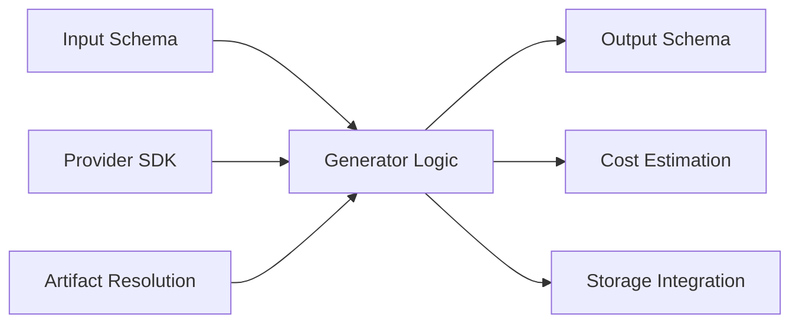

# Creating Generators

This guide provides comprehensive information on creating generators for the Boards system, covering advanced patterns, best practices, and real-world examples.

:::tip
For detailed information about designing input schemas, see the [Input Schemas Guide](./input-schemas.md). Input schemas automatically drive frontend UI generation.
:::

## Generator Architecture

Every generator follows the same simple pattern:



## Core Components

### 1. Input Schema Definition

Your input schema defines what data your generator needs and how it should be validated.

#### Basic Fields

```python
from pydantic import BaseModel, Field
from typing import Optional

class BasicInput(BaseModel):
    # Required text field
    prompt: str = Field(
        description="Text description of what to generate",
        min_length=1,
        max_length=1000
    )
    
    # Optional field with default
    quality: str = Field(
        default="standard",
        description="Generation quality level"
    )
    
    # Numeric field with constraints
    strength: float = Field(
        default=0.75,
        description="Generation strength",
        ge=0.0,    # greater than or equal to 0
        le=1.0     # less than or equal to 1
    )
    
    # Integer with specific range
    steps: int = Field(
        default=50,
        description="Number of generation steps",
        ge=1,
        le=500
    )
```

#### Enumerated Values

```python
from enum import Enum

class ImageSize(str, Enum):
    SMALL = "512x512"
    MEDIUM = "768x768"
    LARGE = "1024x1024"
    WIDE = "1024x576"
    TALL = "576x1024"

class EnumInput(BaseModel):
    size: ImageSize = Field(
        default=ImageSize.MEDIUM,
        description="Output image size"
    )
    
    # Alternative pattern using regex
    aspect_ratio: str = Field(
        default="1:1",
        description="Image aspect ratio",
        pattern="^(1:1|4:3|16:9|3:4|9:16)$"
    )
```

#### Artifact Inputs

```python
from boards.generators.artifacts import ImageArtifact, AudioArtifact, TextArtifact

class ArtifactInput(BaseModel):
    # Single artifact input
    reference_image: ImageArtifact = Field(
        description="Reference image for style transfer"
    )
    
    # Optional artifact
    background_music: Optional[AudioArtifact] = Field(
        None,
        description="Optional background music to add"
    )
    
    # Multiple artifacts
    source_images: list[ImageArtifact] = Field(
        description="Images to combine",
        min_items=2,
        max_items=10
    )
```

#### Advanced Validation

```python
from pydantic import field_validator, model_validator
from typing import Self

class AdvancedInput(BaseModel):
    prompt: str
    negative_prompt: str = ""
    seed: Optional[int] = None
    
    @field_validator('prompt')
    @classmethod
    def validate_prompt(cls, v: str) -> str:
        """Custom field validation."""
        v = v.strip()
        if not v:
            raise ValueError('Prompt cannot be empty')
        
        # Check for inappropriate content
        forbidden_terms = ['violence', 'hate', 'explicit']
        if any(term in v.lower() for term in forbidden_terms):
            raise ValueError('Prompt contains inappropriate content')
        
        return v
    
    @field_validator('seed')  
    @classmethod
    def validate_seed(cls, v: Optional[int]) -> Optional[int]:
        """Validate seed range."""
        if v is not None and (v < 0 or v > 2**32):
            raise ValueError('Seed must be between 0 and 2^32')
        return v
    
    @model_validator(mode='after')
    def validate_prompt_combination(self) -> Self:
        """Cross-field validation."""
        if self.prompt and self.negative_prompt:
            # Check that negative prompt doesn't contradict positive
            prompt_words = set(self.prompt.lower().split())
            neg_words = set(self.negative_prompt.lower().split())
            
            overlap = prompt_words & neg_words
            if overlap:
                raise ValueError(f"Conflicting terms in prompts: {', '.join(overlap)}")
        
        return self
```

### 2. Generator Implementation

#### Basic Structure

```python
import os
from typing import Type
from boards.generators.base import BaseGenerator

class MyGenerator(BaseGenerator):
    # Required class attributes
    name = "my-generator"
    artifact_type = "image"  # or "video", "audio", "text", "lora"
    description = "Description of what this generator does"
    
    def get_input_schema(self) -> Type[BaseModel]:
        """Return the input schema class."""
        return MyInput
    
    def get_output_schema(self) -> Type[BaseModel]:
        """Return the output schema class."""
        return MyOutput
    
    async def generate(self, inputs: MyInput) -> MyOutput:
        """Core generation logic."""
        # Implementation here
        pass
    
    async def estimate_cost(self, inputs: MyInput) -> float:
        """Estimate generation cost in USD."""
        # Implementation here
        pass
```

#### Environment and Configuration

```python
async def generate(self, inputs: MyInput) -> MyOutput:
    """Generate with proper environment validation."""
    
    # 1. Validate environment variables
    api_key = os.getenv("PROVIDER_API_KEY")
    if not api_key:
        raise ValueError(
            "PROVIDER_API_KEY environment variable is required. "
            "Get your API key from https://provider.com/account/api-keys"
        )
    
    # 2. Import provider SDK
    try:
        import provider_sdk
    except ImportError:
        raise ValueError(
            "Provider SDK not installed. Run: pip install provider-sdk"
        )
    
    # 3. Initialize client
    client = provider_sdk.Client(api_key=api_key)
    
    # Continue with generation...
```

#### Artifact Resolution

```python
from boards.generators.resolution import resolve_artifact

async def generate(self, inputs: MyInput) -> MyOutput:
    """Generate with artifact resolution."""
    
    # Resolve artifact inputs to file paths
    if inputs.reference_image:
        image_path = await resolve_artifact(inputs.reference_image)
        print(f"Using reference image at: {image_path}")
    
    if inputs.source_audio:
        audio_path = await resolve_artifact(inputs.source_audio)
    
    # For TextArtifact, use content directly
    if inputs.text_input:
        text_content = inputs.text_input.content
    
    # Use resolved paths with provider SDK
    result = await provider_sdk.process(
        image=image_path,
        audio=audio_path,
        text=text_content,
        **other_params
    )
    
    return result
```

#### Error Handling

```python
async def generate(self, inputs: MyInput) -> MyOutput:
    """Generate with comprehensive error handling."""
    
    try:
        result = await provider.generate(inputs.dict())
        
    except provider.AuthenticationError:
        raise ValueError(
            "Authentication failed. Check your API key in PROVIDER_API_KEY"
        )
        
    except provider.RateLimitError as e:
        retry_after = getattr(e, 'retry_after', 60)
        raise ValueError(
            f"Rate limit exceeded. Please retry after {retry_after} seconds"
        )
        
    except provider.ValidationError as e:
        raise ValueError(f"Invalid input parameters: {e.message}")
        
    except provider.InsufficientCreditsError:
        raise ValueError(
            "Insufficient credits. Please add credits to your provider account"
        )
        
    except Exception as e:
        # Log the full error for debugging
        import logging
        logging.exception("Unexpected error in generation")
        
        # Return user-friendly message
        raise RuntimeError(
            f"Generation failed due to an unexpected error. "
            f"Please try again or contact support if the issue persists."
        )
```

### 3. Output Schema and Storage

#### Simple Output

```python
from boards.generators.artifacts import ImageArtifact
from boards.generators.resolution import store_image_result

class SimpleOutput(BaseModel):
    image: ImageArtifact

async def generate(self, inputs: MyInput) -> SimpleOutput:
    # ... generation logic ...
    
    # Store result and create artifact
    image_artifact = await store_image_result(
        storage_url=result_url,
        format="png",
        generation_id="temp_gen_id",  # TODO: Get from context
        width=1024,
        height=1024
    )
    
    return SimpleOutput(image=image_artifact)
```

#### Complex Output with Metadata

```python
class DetailedOutput(BaseModel):
    primary_image: ImageArtifact
    thumbnail: ImageArtifact
    generation_metadata: dict = Field(default_factory=dict)
    processing_time: float
    used_seed: int

async def generate(self, inputs: MyInput) -> DetailedOutput:
    start_time = time.time()
    
    # ... generation logic ...
    
    processing_time = time.time() - start_time
    
    # Create multiple artifacts
    primary = await store_image_result(result_url, "png", gen_id, 1024, 1024)
    thumb = await store_image_result(thumb_url, "jpg", gen_id, 256, 256)
    
    return DetailedOutput(
        primary_image=primary,
        thumbnail=thumb,
        generation_metadata={
            "model_version": "v2.1",
            "inference_steps": inputs.steps,
            "guidance_scale": inputs.guidance,
        },
        processing_time=processing_time,
        used_seed=actual_seed_used
    )
```

### 4. Cost Estimation

#### Simple Fixed Cost

```python
async def estimate_cost(self, inputs: MyInput) -> float:
    """Fixed cost per generation."""
    return 0.05  # $0.05 per generation
```

#### Dynamic Cost Calculation

```python
async def estimate_cost(self, inputs: MyInput) -> float:
    """Cost based on input parameters."""
    base_cost = 0.01
    
    # Factor in quality settings
    quality_multipliers = {
        "draft": 0.5,
        "standard": 1.0, 
        "high": 2.0,
        "ultra": 4.0
    }
    quality_cost = base_cost * quality_multipliers.get(inputs.quality, 1.0)
    
    # Factor in size
    pixel_count = inputs.width * inputs.height
    size_cost = (pixel_count / (512 * 512)) * 0.001  # $0.001 per 512x512 equivalent
    
    # Factor in processing complexity
    step_cost = (inputs.num_steps / 50) * 0.002  # More steps = higher cost
    
    return quality_cost + size_cost + step_cost
```

#### Provider-Based Cost Estimation

```python
async def estimate_cost(self, inputs: MyInput) -> float:
    """Estimate cost using provider pricing."""
    
    # Different providers have different pricing models
    provider_costs = {
        "replicate": {
            "base": 0.0023,
            "per_step": 0.000046,  # Additional cost per inference step
            "per_megapixel": 0.001
        },
        "openai": {
            "standard_1024": 0.040,
            "hd_1024": 0.080,
            "standard_non_square": 0.040,
            "hd_non_square": 0.080
        }
    }
    
    # Example for Replicate-style pricing
    base = provider_costs["replicate"]["base"]
    steps_cost = (inputs.num_steps - 50) * provider_costs["replicate"]["per_step"]
    
    megapixels = (inputs.width * inputs.height) / 1_000_000
    size_cost = megapixels * provider_costs["replicate"]["per_megapixel"]
    
    return max(0, base + steps_cost + size_cost)
```

## Advanced Patterns

### 1. Multi-Artifact Inputs

```python
class VideoMixingInput(BaseModel):
    """Mix multiple videos with transitions."""
    source_videos: list[VideoArtifact] = Field(
        description="Videos to mix together",
        min_items=2,
        max_items=5
    )
    transition_style: str = Field(
        default="fade",
        description="Transition between videos"
    )
    background_music: Optional[AudioArtifact] = Field(
        None,
        description="Optional background music"
    )

async def generate(self, inputs: VideoMixingInput) -> VideoMixingOutput:
    # Resolve all video artifacts
    video_paths = []
    for video_artifact in inputs.source_videos:
        path = await resolve_artifact(video_artifact)
        video_paths.append(path)
    
    # Optionally resolve audio
    music_path = None
    if inputs.background_music:
        music_path = await resolve_artifact(inputs.background_music)
    
    # Process with video editing SDK
    result = await video_editor.mix_videos(
        videos=video_paths,
        transition=inputs.transition_style,
        background_music=music_path
    )
    
    return result
```

### 2. Conditional Input Processing

```python
class ConditionalInput(BaseModel):
    mode: str = Field(description="Processing mode", pattern="^(text|image|hybrid)$")
    
    # Text mode inputs
    text_prompt: Optional[str] = Field(None)
    style_description: Optional[str] = Field(None)
    
    # Image mode inputs  
    reference_image: Optional[ImageArtifact] = Field(None)
    image_strength: Optional[float] = Field(None, ge=0.0, le=1.0)
    
    # Hybrid mode uses both
    
    @model_validator(mode='after')
    def validate_mode_inputs(self) -> Self:
        if self.mode == "text":
            if not self.text_prompt:
                raise ValueError("text_prompt required for text mode")
        elif self.mode == "image":
            if not self.reference_image:
                raise ValueError("reference_image required for image mode")
        elif self.mode == "hybrid":
            if not self.text_prompt or not self.reference_image:
                raise ValueError("Both text_prompt and reference_image required for hybrid mode")
        
        return self

async def generate(self, inputs: ConditionalInput) -> MyOutput:
    if inputs.mode == "text":
        return await self._generate_from_text(inputs)
    elif inputs.mode == "image":
        return await self._generate_from_image(inputs)
    else:  # hybrid
        return await self._generate_hybrid(inputs)
```

### 3. Streaming and Progress Callbacks

```python
from typing import Callable, Optional, AsyncGenerator

class StreamingGenerator(BaseGenerator):
    async def generate_streaming(
        self, 
        inputs: MyInput,
        progress_callback: Optional[Callable[[float, str], None]] = None
    ) -> AsyncGenerator[MyOutput, None]:
        """Generate with streaming progress updates."""
        
        if progress_callback:
            progress_callback(0.0, "Starting generation...")
        
        # Initialize provider
        client = provider_sdk.Client()
        
        if progress_callback:
            progress_callback(0.1, "Initializing model...")
        
        # Start generation
        job = await client.start_generation(inputs.dict())
        
        # Poll for progress
        while not job.is_complete():
            await asyncio.sleep(1)
            job.refresh()
            
            if progress_callback:
                progress_callback(job.progress, f"Processing... ({job.progress:.1%})")
        
        if progress_callback:
            progress_callback(1.0, "Generation complete")
        
        # Return final result
        result = await self._create_output(job.result)
        yield result
```

### 4. Batch Processing

```python
class BatchInput(BaseModel):
    prompts: list[str] = Field(description="Multiple prompts to process", max_items=10)
    shared_settings: dict = Field(default_factory=dict)

class BatchOutput(BaseModel):
    results: list[ImageArtifact]
    failed_indices: list[int] = Field(default_factory=list)

async def generate_batch(self, inputs: BatchInput) -> BatchOutput:
    """Process multiple prompts in parallel."""
    import asyncio
    
    results = []
    failed_indices = []
    
    async def process_single(idx: int, prompt: str) -> Optional[ImageArtifact]:
        try:
            single_input = MyInput(prompt=prompt, **inputs.shared_settings)
            result = await self.generate(single_input)
            return result.image
        except Exception as e:
            logging.warning(f"Failed to process prompt {idx}: {e}")
            failed_indices.append(idx)
            return None
    
    # Process in parallel with concurrency limit
    semaphore = asyncio.Semaphore(3)  # Max 3 concurrent generations
    
    async def bounded_process(idx: int, prompt: str):
        async with semaphore:
            return await process_single(idx, prompt)
    
    tasks = [
        bounded_process(idx, prompt) 
        for idx, prompt in enumerate(inputs.prompts)
    ]
    
    results = await asyncio.gather(*tasks, return_exceptions=True)
    
    # Filter out failed results
    successful_results = [r for r in results if isinstance(r, ImageArtifact)]
    
    return BatchOutput(
        results=successful_results,
        failed_indices=failed_indices
    )
```

## Testing Patterns

### 1. Basic Generator Testing

```python
import pytest
from unittest.mock import patch, AsyncMock

class TestMyGenerator:
    def setup_method(self):
        self.generator = MyGenerator()
    
    def test_schemas(self):
        """Test input/output schema definitions."""
        input_schema = self.generator.get_input_schema()
        output_schema = self.generator.get_output_schema()
        
        assert input_schema == MyInput
        assert output_schema == MyOutput
        
        # Test schema can generate JSON schema
        json_schema = input_schema.model_json_schema()
        assert "properties" in json_schema
        assert "prompt" in json_schema["properties"]
```

### 2. Mocking Provider APIs

```python
@pytest.mark.asyncio
async def test_generate_success(self):
    """Test successful generation."""
    inputs = MyInput(prompt="test prompt")
    
    with patch.dict(os.environ, {"API_KEY": "fake-key"}):
        with patch('provider_sdk.Client') as mock_client_class:
            # Setup mocks
            mock_client = AsyncMock()
            mock_client_class.return_value = mock_client
            mock_client.generate.return_value = "fake_result_url"
            
            # Mock storage
            with patch('my_generator.store_image_result') as mock_store:
                mock_artifact = ImageArtifact(
                    generation_id="test", 
                    storage_url="fake_url",
                    width=512, 
                    height=512, 
                    format="png"
                )
                mock_store.return_value = mock_artifact
                
                # Execute
                result = await self.generator.generate(inputs)
                
                # Verify
                assert isinstance(result, MyOutput)
                assert result.image == mock_artifact
                
                # Verify API was called correctly
                mock_client.generate.assert_called_once()
                call_args = mock_client.generate.call_args[1]
                assert call_args["prompt"] == "test prompt"
```

### 3. Testing Error Conditions

```python
@pytest.mark.asyncio
async def test_missing_api_key(self):
    """Test error when API key is missing."""
    inputs = MyInput(prompt="test")
    
    with patch.dict(os.environ, {}, clear=True):
        with pytest.raises(ValueError, match="API_KEY.*required"):
            await self.generator.generate(inputs)

@pytest.mark.asyncio
async def test_provider_rate_limit(self):
    """Test handling of provider rate limits."""
    inputs = MyInput(prompt="test")
    
    with patch.dict(os.environ, {"API_KEY": "fake-key"}):
        with patch('provider_sdk.Client') as mock_client_class:
            mock_client = AsyncMock()
            mock_client_class.return_value = mock_client
            
            # Mock rate limit error
            from provider_sdk import RateLimitError
            mock_client.generate.side_effect = RateLimitError("Rate limited", retry_after=60)
            
            with pytest.raises(ValueError, match="Rate limit.*60 seconds"):
                await self.generator.generate(inputs)
```

## Registration and Discovery

### 1. Automatic Registration

```python
# At the bottom of your generator file
from boards.generators.registry import registry
registry.register(MyGenerator())
```

### 2. Conditional Registration

```python
# Only register if dependencies are available
try:
    import provider_sdk
    registry.register(MyGenerator())
except ImportError:
    logging.warning("MyGenerator not registered - provider_sdk not available")
```

### 3. Plugin-Style Registration

```python
# In your package's __init__.py
def register_generators():
    """Register all generators in this package."""
    from .my_generator import MyGenerator
    from .another_generator import AnotherGenerator
    
    registry.register(MyGenerator())
    registry.register(AnotherGenerator())

# Auto-register on import
register_generators()
```

## Best Practices

### 1. **Clear Naming**
- Use descriptive generator names: `"flux-pro"`, `"stable-diffusion-xl"`
- Avoid generic names: `"image-gen"`, `"ai-model"`

### 2. **Comprehensive Validation**
- Validate all inputs thoroughly
- Provide clear error messages
- Use Pydantic's full validation capabilities

### 3. **Proper Error Handling**
- Check environment variables early
- Translate provider errors to user-friendly messages
- Log technical details, show friendly messages to users

### 4. **Accurate Cost Estimation**
- Research actual provider pricing
- Factor in all cost variables
- Update costs when provider pricing changes

### 5. **Good Documentation**
- Document all input fields clearly
- Provide examples in docstrings
- Explain any non-obvious behavior

### 6. **Comprehensive Testing**
- Test happy path and error conditions
- Mock external dependencies
- Test cost estimation accuracy
- Include integration tests when possible

This comprehensive guide should give you everything you need to create robust, well-tested generators for the Boards system!
