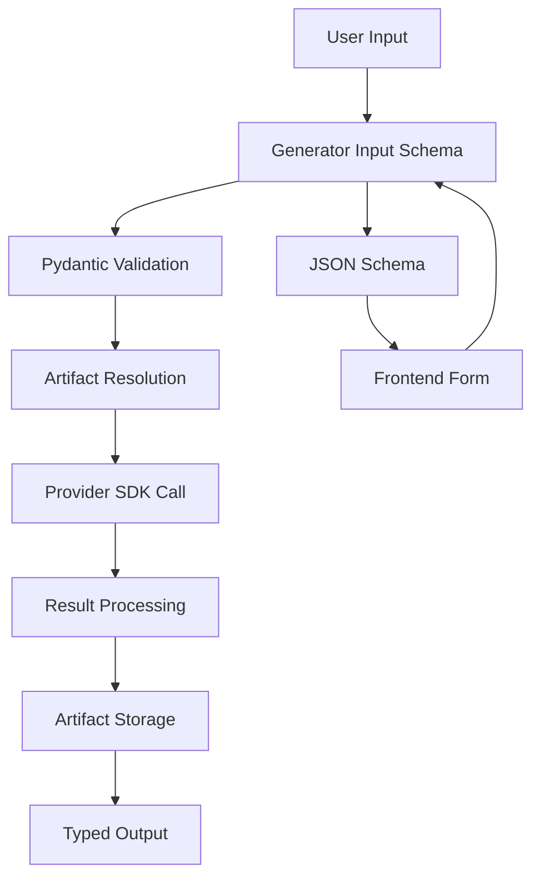

# Generators Overview

Generators are the heart of the Boards system - they integrate AI generation services and define how different types of content are created. From text-to-image models like FLUX and DALL-E, to video processing like lip sync, to audio transcription with Whisper, generators make it easy to work with any AI service.

## What are Generators?

A generator is a component that:

- **Defines input requirements** using Pydantic schemas (what data is needed)
- **Integrates with AI services** using their native Python SDKs
- **Produces typed outputs** as artifact objects (images, videos, audio, etc.)
- **Estimates costs** for budget planning and billing
- **Handles artifacts intelligently** by resolving references to actual files

## Key Features

### 🏗️ **Minimal Code Required**
Creating a new generator typically requires less than 50 lines of Python code. You just define Pydantic input/output schemas and implement the generation logic.

### 🔒 **Full Type Safety**
Your Pydantic schemas automatically generate JSON schemas that become TypeScript types for the frontend, ensuring type safety throughout the entire stack.

### 🔗 **Artifact Chaining**  
Generators can use outputs from other generators as inputs. For example, a lip sync generator takes both video and audio artifacts to create a new video.

### 🚀 **Native SDK Integration**
No wrapper layers or generic REST clients - generators import and use provider SDKs directly (Replicate, OpenAI, Fal.ai, etc.).

### 🎛️ **Auto-Generated UI**
The frontend automatically creates appropriate form controls based on your input schema - text fields, sliders, dropdowns, and drag/drop zones.

## How Generators Work



1. **Input Definition**: You define what inputs your generator needs using Pydantic models
2. **Validation**: Inputs are automatically validated against your schema
3. **Artifact Resolution**: Any artifact inputs are resolved to file paths for SDKs
4. **Generation**: Your code calls the provider SDK directly
5. **Output Processing**: Results are stored and wrapped in typed artifact objects
6. **Frontend Integration**: JSON schemas enable automatic UI generation

## Built-in Generators

Boards comes with several example generators:

| Generator | Type | Provider | Description |
|-----------|------|----------|-------------|
| **FLUX Pro** | Image | Replicate | High-quality text-to-image generation |
| **DALL-E 3** | Image | OpenAI | Advanced text-to-image with style control |
| **Lip Sync** | Video | Replicate | Sync video lips to audio track |
| **Whisper** | Text | OpenAI | Speech-to-text transcription |

## Artifact Types

Generators work with strongly-typed artifacts:

- **ImageArtifact**: Images with dimensions, format, and metadata
- **VideoArtifact**: Videos with duration, resolution, and frame rate
- **AudioArtifact**: Audio with duration, sample rate, and channels  
- **TextArtifact**: Text content with format specification
- **LoRArtifact**: LoRA models with base model and trigger words

## Example: Simple Image Generator

Here's what a basic text-to-image generator looks like:

```python
from pydantic import BaseModel, Field
from boards.generators.base import BaseGenerator
from boards.generators.artifacts import ImageArtifact

class SimpleImageInput(BaseModel):
    prompt: str = Field(description="What to generate")
    
class SimpleImageOutput(BaseModel):
    image: ImageArtifact

class SimpleImageGenerator(BaseGenerator):
    name = "simple-image"
    artifact_type = "image"
    description = "Basic image generation"
    
    def get_input_schema(self):
        return SimpleImageInput
    
    async def generate(self, inputs):
        # Use any provider SDK directly
        import replicate
        result_url = await replicate.async_run("model", input={"prompt": inputs.prompt})
        
        # Store and return artifact
        image = await store_image_result(result_url, "png", "gen_id", 1024, 1024)
        return SimpleImageOutput(image=image)
    
    async def estimate_cost(self, inputs):
        return 0.05  # $0.05 per generation
```

The frontend automatically creates a form with a text input for the prompt, and when submitted, displays the generated image.

## Next Steps

- [**Getting Started**](./getting-started): Set up your first generator
- [**Creating Generators**](./creating-generators): Detailed guide to building generators  
- [**Artifact Types**](./artifact-types): Understanding the artifact system
- [**Examples**](./examples): Real-world generator implementations

## Benefits for Developers

### Backend Developers
- **Simple Integration**: Just define schemas and call provider SDKs
- **Type Safety**: Pydantic validation prevents runtime errors
- **Testing Support**: Built-in patterns for comprehensive testing

### Frontend Developers  
- **Automatic Types**: TypeScript interfaces generated from your schemas
- **Auto UI**: Forms and controls generated automatically
- **Drag & Drop**: Artifact inputs become drag/drop zones

### Users
- **Consistent UX**: All generators work the same way in the interface
- **Chaining**: Use outputs from one generator as inputs to another
- **Cost Transparency**: See estimated costs before running generations