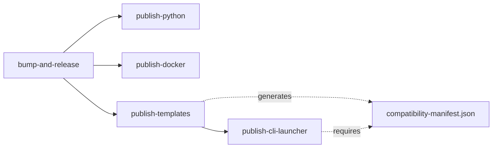

# CLI-7.10: Update Release Workflow for Compatibility Manifests

## Description

Update the GitHub Actions release workflow (`version-bump.yml`) to generate and publish compatibility manifests as release assets. This ensures every release includes a compatibility manifest that the CLI can fetch during upgrades.

The workflow should:
- Run the compatibility manifest generation script
- Validate the generated manifest
- Upload the manifest to GitHub Release assets alongside templates
- Ensure manifests are published BEFORE users can upgrade to that version

## Dependencies

- CLI-7.9 (Compatibility Manifest Generation Script)
- CLI-2.4 (Template Publishing to Workflow) - understand release asset upload

## Files to Create/Modify

### Modified Files
- `.github/workflows/version-bump.yml` - Add compatibility manifest generation and upload

## Implementation Details

### Workflow Changes

```yaml
# .github/workflows/version-bump.yml

# ... existing jobs: bump-and-release, publish-python, publish-npm, etc. ...

  publish-templates:
    needs: bump-and-release
    runs-on: ubuntu-latest
    permissions:
      contents: write

    steps:
      - uses: actions/checkout@v4
        with:
          ref: "v${{ needs.bump-and-release.outputs.version }}"

      - name: Install pnpm
        uses: pnpm/action-setup@v2
        with:
          version: 9

      - name: Setup Node.js
        uses: actions/setup-node@v4
        with:
          node-version: "20.x"
          cache: "pnpm"

      - name: Install dependencies
        run: pnpm install

      - name: Build templates
        run: |
          VERSION=${{ needs.bump-and-release.outputs.version }}
          ./scripts/prepare-release-templates.sh "$VERSION"

      # NEW: Generate compatibility manifest
      - name: Generate compatibility manifest
        run: |
          VERSION=${{ needs.bump-and-release.outputs.version }}
          node scripts/generate-compatibility-manifest.js \
            --version "$VERSION" \
            --output dist/compatibility-manifest.json

      # NEW: Validate manifest
      - name: Validate compatibility manifest
        run: |
          # Ensure manifest exists and is valid JSON
          if [ ! -f dist/compatibility-manifest.json ]; then
            echo "❌ Compatibility manifest not generated"
            exit 1
          fi

          # Check it's valid JSON
          jq empty dist/compatibility-manifest.json || {
            echo "❌ Invalid JSON in compatibility manifest"
            exit 1
          }

          # Display manifest for debugging
          echo "Generated compatibility manifest:"
          cat dist/compatibility-manifest.json

      - name: Upload templates and manifest to release
        uses: softprops/action-gh-release@v1
        with:
          tag_name: "v${{ needs.bump-and-release.outputs.version }}"
          files: |
            dist/template-baseboards-v${{ needs.bump-and-release.outputs.version }}.tar.gz
            dist/template-basic-v${{ needs.bump-and-release.outputs.version }}.tar.gz
            dist/template-manifest.json
            dist/compatibility-manifest.json
          token: ${{ secrets.GITHUB_TOKEN }}
```

### Pre-Release Checklist

Add to release documentation:

```markdown
## Release Checklist

Before triggering the release workflow:

1. **Update CHANGELOG.md**
   - Add new version section
   - Document breaking changes under "### Breaking Changes"
   - Use format: `- **category**: Description → Mitigation`

2. **Update storage format version** (if storage format changed)
   - Edit `packages/backend/src/boards/constants.py`
   - Increment `STORAGE_FORMAT_VERSION`

3. **Test locally**
   ```bash
   # Generate compatibility manifest locally
   node scripts/generate-compatibility-manifest.js \
     --version 0.8.0 \
     --output dist/compatibility-manifest.json

   # Verify it looks correct
   cat dist/compatibility-manifest.json
   ```

4. **Trigger release workflow**
   - Go to Actions → Version Bump and Release
   - Select bump type (major, minor, patch)
   - Run workflow

5. **Verify release assets**
   - Check GitHub Release page
   - Ensure compatibility-manifest.json is uploaded
   - Download and verify manifest is valid
```

## Testing

### Local Testing

```bash
# 1. Test manifest generation locally
node scripts/generate-compatibility-manifest.js \
  --version 0.8.0 \
  --output dist/compatibility-manifest.json

# 2. Validate generated manifest
jq empty dist/compatibility-manifest.json

# 3. Check manifest structure
cat dist/compatibility-manifest.json | jq '.'

# 4. Test CLI can fetch it (after uploading to test release)
# Create test release and upload manifest
gh release create v0.8.0-test \
  --title "Test Release" \
  --notes "Testing compatibility manifest" \
  --prerelease \
  dist/compatibility-manifest.json

# Test CLI fetch
cd test-project
baseboards upgrade . --version 0.8.0-test --dry-run
```

### CI/CD Testing

```bash
# 1. Create test branch and trigger workflow
git checkout -b test-release
git push origin test-release

# 2. Manually trigger workflow on test branch

# 3. Verify:
# - Workflow completes successfully
# - Release is created
# - compatibility-manifest.json is uploaded
# - Manifest is valid JSON

# 4. Test CLI upgrade with test release
baseboards upgrade . --version <test-version> --dry-run
```

## Acceptance Criteria

- [ ] Workflow generates compatibility manifest after building templates
- [ ] Manifest is validated before upload (valid JSON, matches schema)
- [ ] Manifest is uploaded to GitHub Release assets
- [ ] Manifest appears alongside template tarballs in release
- [ ] Workflow fails if manifest generation fails
- [ ] Workflow fails if manifest is invalid JSON
- [ ] Manifest is generated BEFORE CLI package is published
- [ ] Pre-release checklist documented
- [ ] Local testing instructions documented
- [ ] Test release created and CLI successfully fetches manifest
- [ ] Production release includes manifest

## Notes

- Manifest must be uploaded BEFORE the CLI is published to npm (order matters)
- The workflow should fail if manifest generation fails (required asset)
- Validate manifest is valid JSON and matches schema before upload
- Consider adding a workflow step to test the CLI can fetch the manifest
- Document the release process for maintainers
- Add manifest validation to pre-commit hooks or CI checks

### Workflow Job Dependencies



The `publish-cli-launcher` job should depend on `publish-templates` to ensure manifests are available before the CLI is published.

### Error Handling

If manifest generation fails:
1. Workflow should fail (don't publish incomplete release)
2. Notify maintainers via GitHub Actions failure
3. Fix CHANGELOG.md or generation script
4. Re-run workflow

If manifest is missing from a release:
- CLI will return `null` from `fetchCompatibilityManifest()`
- Upgrade will proceed with warning: "No compatibility manifest found"
- This is acceptable for older releases (backward compatible)
