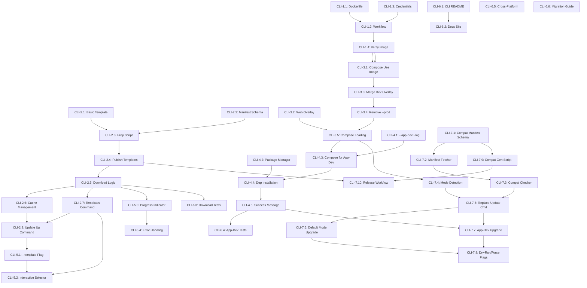

# CLI Launcher Revamp - Implementation Tickets

This directory contains 42 implementation tickets for the CLI launcher revamp, organized into 7 phases. Each ticket is a separate markdown file following GitHub Issues format.

## Overview

The CLI launcher revamp modernizes `@weirdfingers/baseboards` by:
- Publishing pre-built backend Docker images (no local build)
- Downloading templates from GitHub Releases (multiple template options)
- Simplifying to single mode with pre-built images (no hot-reload by default)
- Adding local frontend development mode with hot-reload (--app-dev flag)
- Improving template selection UX (interactive prompts)
- Implementing in-place upgrade workflow with compatibility checking

See [../cli-launcher-revamp.md](../cli-launcher-revamp.md) for the full design document.

## Ticket Organization

**Format:** `CLI-[Phase].[Number].md`

### Phase 1: Docker Image Publishing (4 tickets)
**Goal:** Publish backend images to GHCR and Docker Hub

- [CLI-1.1](CLI-1.1.md) - Create Production Backend Dockerfile
- [CLI-1.2](CLI-1.2.md) - Add Docker Build to GitHub Workflow
- [CLI-1.3](CLI-1.3.md) - Configure Registry Credentials
- [CLI-1.4](CLI-1.4.md) - Verify Image Works with Current Setup

### Phase 2: Template System (8 tickets)
**Goal:** Download templates from GitHub Releases

- [CLI-2.1](CLI-2.1.md) - Create Basic Template Structure
- [CLI-2.2](CLI-2.2.md) - Create Template Manifest Schema
- [CLI-2.3](CLI-2.3.md) - Create Release Template Preparation Script
- [CLI-2.4](CLI-2.4.md) - Add Template Publishing to Workflow
- [CLI-2.5](CLI-2.5.md) - Implement Template Download Logic
- [CLI-2.6](CLI-2.6.md) - Implement Template Cache Management
- [CLI-2.7](CLI-2.7.md) - Add Templates Command
- [CLI-2.8](CLI-2.8.md) - Update Up Command to Use Template Downloader

### Phase 3: Remove Prod Mode, Update Compose (5 tickets)
**Goal:** Simplify to single mode with pre-built images (no hot-reload by default)

- [CLI-3.1](CLI-3.1.md) - Update Base Compose to Use Docker Image (no --reload)
- [CLI-3.2](CLI-3.2.md) - Create Web Service Overlay Compose (production build)
- [CLI-3.3](CLI-3.3.md) - Merge Dev Overlay into Base Compose (no hot-reload)
- [CLI-3.4](CLI-3.4.md) - Remove --prod and --dev Flags from CLI
- [CLI-3.5](CLI-3.5.md) - Update Compose File Loading Logic

### Phase 4: App-Dev Mode (5 tickets)
**Goal:** Support local frontend development

- [CLI-4.1](CLI-4.1.md) - Add --app-dev Flag
- [CLI-4.2](CLI-4.2.md) - Implement Package Manager Selection
- [CLI-4.3](CLI-4.3.md) - Update Compose Loading for App-Dev
- [CLI-4.4](CLI-4.4.md) - Add Frontend Dependency Installation
- [CLI-4.5](CLI-4.5.md) - Update Success Message for App-Dev

### Phase 5: Template Selection UX (4 tickets)
**Goal:** Interactive template selection

- [CLI-5.1](CLI-5.1.md) - Add --template Flag
- [CLI-5.2](CLI-5.2.md) - Implement Interactive Template Selector
- [CLI-5.3](CLI-5.3.md) - Add Template Download Progress Indicator
- [CLI-5.4](CLI-5.4.md) - Handle Template Download Errors Gracefully

### Phase 6: Documentation and Testing (6 tickets)
**Goal:** Comprehensive docs and tests

- [CLI-6.1](CLI-6.1.md) - Update CLI README
- [CLI-6.2](CLI-6.2.md) - Update Main Documentation Site
- [CLI-6.3](CLI-6.3.md) - Add Template Download Integration Tests
- [CLI-6.4](CLI-6.4.md) - Add App-Dev Mode Integration Tests
- [CLI-6.5](CLI-6.5.md) - Cross-Platform Testing
- [CLI-6.6](CLI-6.6.md) - Create Migration Guide

### Phase 7: Upgrade Command (10 tickets)
**Goal:** Implement in-place upgrade workflow

- [CLI-7.1](CLI-7.1.md) - Create Compatibility Manifest Schema
- [CLI-7.2](CLI-7.2.md) - Implement Compatibility Manifest Fetcher
- [CLI-7.3](CLI-7.3.md) - Implement Version Compatibility Checker
- [CLI-7.4](CLI-7.4.md) - Implement Mode Detection (Default vs App-Dev)
- [CLI-7.5](CLI-7.5.md) - Replace Update Command with Upgrade Command
- [CLI-7.6](CLI-7.6.md) - Implement Default Mode Upgrade Flow
- [CLI-7.7](CLI-7.7.md) - Implement App-Dev Mode Upgrade Flow
- [CLI-7.8](CLI-7.8.md) - Add Dry-Run and Force Flags
- [CLI-7.9](CLI-7.9.md) - Create Compatibility Manifest Generation Script
- [CLI-7.10](CLI-7.10.md) - Update Release Workflow for Compatibility Manifests

## Dependency Graph



## Critical Path

The critical path for implementation (tickets that block other phases):

1. **CLI-1.1 → CLI-1.2 → CLI-1.4** (Docker images must exist before compose can use them)
2. **CLI-1.4 → CLI-3.1** (Verified images before using in compose)
3. **CLI-2.1 → CLI-2.3 → CLI-2.4 → CLI-2.5** (Template system foundation)
4. **CLI-2.8** (Integration of template system into CLI)
5. **CLI-3.1 → CLI-3.3 → CLI-3.4 → CLI-3.5** (Compose simplification)
6. **CLI-3.5 → CLI-4.3** (Compose loading before app-dev)
7. **CLI-4.3 → CLI-4.4 → CLI-4.5** (App-dev mode implementation)
8. **CLI-7.1 → CLI-7.2 → CLI-7.3** (Compatibility system foundation)
9. **CLI-7.3 → CLI-7.5** (Compatibility checking before upgrade command)
10. **CLI-7.5 → CLI-7.6/CLI-7.7** (Upgrade command routes to mode-specific flows)
11. **CLI-7.9 → CLI-7.10** (Manifest generation before release workflow)

## Implementation Order

**Recommended sequence (10 weeks):**

### Week 1-2: Phase 1 (Docker Images)
Focus: Get backend images published
- CLI-1.1, CLI-1.3 (parallel)
- CLI-1.2
- CLI-1.4

### Week 3-4: Phase 2 (Template System)
Focus: Build template download and caching
- CLI-2.1, CLI-2.2 (parallel)
- CLI-2.3
- CLI-2.4
- CLI-2.5, CLI-2.6 (sequential)
- CLI-2.7, CLI-2.8

### Week 5: Phase 3 (Simplify Compose)
Focus: Single mode with pre-built images, no hot-reload
- CLI-3.1, CLI-3.2 (parallel)
- CLI-3.3
- CLI-3.4, CLI-3.5

### Week 6: Phase 4 (App-Dev Mode)
Focus: Local frontend development
- CLI-4.1, CLI-4.2 (parallel)
- CLI-4.3
- CLI-4.4
- CLI-4.5

### Week 7: Phase 5 (Template UX)
Focus: Polish template selection
- CLI-5.1
- CLI-5.2, CLI-5.3 (parallel)
- CLI-5.4

### Week 8-9: Phase 7 (Upgrade Command)
Focus: In-place upgrade workflow
- CLI-7.1 (manifest schema)
- CLI-7.2, CLI-7.4 (parallel: fetcher and mode detection)
- CLI-7.3 (compatibility checker)
- CLI-7.5 (replace update command)
- CLI-7.6, CLI-7.7 (parallel: default and app-dev flows)
- CLI-7.8 (dry-run/force flags)
- CLI-7.9, CLI-7.10 (sequential: generate script, update workflow)

### Week 10: Phase 6 (Docs & Testing)
Focus: Documentation and quality assurance
- CLI-6.1, CLI-6.3, CLI-6.4 (parallel)
- CLI-6.2
- CLI-6.5
- CLI-6.6

## Parallel Work Opportunities

These tickets can be worked on in parallel:

- **Phase 1 + Phase 2** (weeks 1-4): Docker images and templates are independent
- **CLI-3.1 + CLI-3.2**: Compose updates can happen in parallel
- **CLI-4.1 + CLI-4.2**: Flag and package manager selection are independent
- **CLI-5.1 + CLI-5.3**: Flag and progress indicator are independent
- **CLI-7.2 + CLI-7.4**: Manifest fetcher and mode detection are independent
- **CLI-7.6 + CLI-7.7**: Default and app-dev upgrade flows can be developed in parallel
- **CLI-6.1 + CLI-6.3 + CLI-6.4**: Documentation and testing are independent

## Testing Strategy

### Per-Ticket Testing
Each ticket includes specific acceptance criteria and testing requirements in its "Testing" section.

### Integration Testing Milestones
- **After Phase 1**: Test backend image works with current setup
- **After Phase 2**: Test template download and scaffolding end-to-end
- **After Phase 3**: Test dev mode with Docker images
- **After Phase 4**: Test app-dev mode full workflow
- **After Phase 5**: Test complete UX flow
- **After Phase 7**: Test upgrade flows (default and app-dev modes)
- **After Phase 6**: Final cross-platform validation

### Rollback Points
- After Phase 1: Images published, CLI unchanged (safe)
- After Phase 2: Template system works, old system can be restored
- After Phase 3: **Breaking change** - requires communication
- After Phase 4: App-dev is additive (safe)
- After Phase 5: Template UX improvements (safe)
- After Phase 7: Upgrade command is additive (safe)
- After Phase 6: Documentation only (safe)

## Ticket Format

Each ticket follows this structure:

```markdown
# [Title]

## Description
[What and why]

## Dependencies
[List of prerequisite tickets]

## Files to Create/Modify
[Specific file paths]

## Testing
[How to test, specific test cases]

## Acceptance Criteria
- [ ] Checklist of requirements
```

## Getting Started

1. **Read the design doc**: [../cli-launcher-revamp.md](../cli-launcher-revamp.md)
2. **Review dependencies**: Check the dependency graph above
3. **Start with Phase 1**: Begin with CLI-1.1
4. **Mark completion**: Check off acceptance criteria as you go
5. **Test thoroughly**: Each ticket includes testing requirements
6. **Update this README**: Mark phases as complete below

## Progress Tracking

### Phase 1: Docker Image Publishing
- [ ] CLI-1.1 - Create Production Backend Dockerfile
- [ ] CLI-1.2 - Add Docker Build to GitHub Workflow
- [ ] CLI-1.3 - Configure Registry Credentials
- [ ] CLI-1.4 - Verify Image Works with Current Setup

### Phase 2: Template System
- [ ] CLI-2.1 - Create Basic Template Structure
- [ ] CLI-2.2 - Create Template Manifest Schema
- [ ] CLI-2.3 - Create Release Template Preparation Script
- [ ] CLI-2.4 - Add Template Publishing to Workflow
- [ ] CLI-2.5 - Implement Template Download Logic
- [ ] CLI-2.6 - Implement Template Cache Management
- [ ] CLI-2.7 - Add Templates Command
- [ ] CLI-2.8 - Update Up Command to Use Template Downloader

### Phase 3: Remove Prod Mode, Update Compose
- [ ] CLI-3.1 - Update Base Compose to Use Docker Image
- [ ] CLI-3.2 - Create Web Service Overlay Compose
- [ ] CLI-3.3 - Merge Dev Overlay into Base Compose
- [ ] CLI-3.4 - Remove --prod Flag from CLI
- [ ] CLI-3.5 - Update Compose File Loading Logic

### Phase 4: App-Dev Mode
- [ ] CLI-4.1 - Add --app-dev Flag
- [ ] CLI-4.2 - Implement Package Manager Selection
- [ ] CLI-4.3 - Update Compose Loading for App-Dev
- [ ] CLI-4.4 - Add Frontend Dependency Installation
- [ ] CLI-4.5 - Update Success Message for App-Dev

### Phase 5: Template Selection UX
- [ ] CLI-5.1 - Add --template Flag
- [ ] CLI-5.2 - Implement Interactive Template Selector
- [ ] CLI-5.3 - Add Template Download Progress Indicator
- [ ] CLI-5.4 - Handle Template Download Errors Gracefully

### Phase 6: Documentation and Testing
- [ ] CLI-6.1 - Update CLI README
- [ ] CLI-6.2 - Update Main Documentation Site
- [ ] CLI-6.3 - Add Template Download Integration Tests
- [ ] CLI-6.4 - Add App-Dev Mode Integration Tests
- [ ] CLI-6.5 - Cross-Platform Testing
- [ ] CLI-6.6 - Create Migration Guide

### Phase 7: Upgrade Command
- [ ] CLI-7.1 - Create Compatibility Manifest Schema
- [ ] CLI-7.2 - Implement Compatibility Manifest Fetcher
- [ ] CLI-7.3 - Implement Version Compatibility Checker
- [ ] CLI-7.4 - Implement Mode Detection
- [ ] CLI-7.5 - Replace Update Command with Upgrade Command
- [ ] CLI-7.6 - Implement Default Mode Upgrade Flow
- [ ] CLI-7.7 - Implement App-Dev Mode Upgrade Flow
- [ ] CLI-7.8 - Add Dry-Run and Force Flags
- [ ] CLI-7.9 - Create Compatibility Manifest Generation Script
- [ ] CLI-7.10 - Update Release Workflow for Compatibility Manifests

## Notes

- Breaking changes occur in Phase 3 (removal of prod/dev modes, no hot-reload by default)
- Phase 6 tickets can start anytime but should complete last
- Each phase builds on previous phases
- Testing is critical at each phase boundary
- Document any deviations from the plan in this README
- Hot-reload is intentionally removed in default mode; available via --app-dev for frontend only
